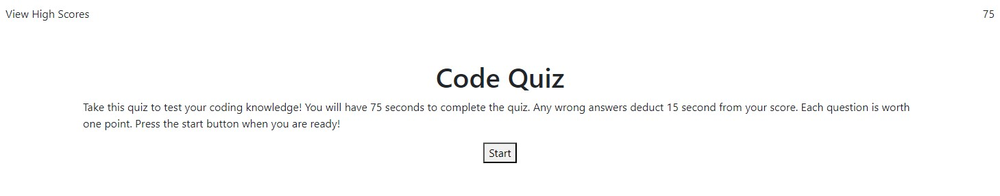

# Code Quiz

## Description

This is a webpage designed to test users on a preset ofcoding questions.

This was mainly a practice in JS including but not limited to:
- query seclectors
- creating and calling functions
- objects
- time intervals
- event listeners
- local storage
- DOM traversal
- generating and removing elements

In the future, a few features will be added:
- keyup event listener on enter key for start button
- keyup event listener on enter key for save score button
- keyup event listener on enter key for "Play Again" button
- keyup event listeners on 1, 2, 3, and 4, keys for selecting answer choices
- display if previous questions was right or wrong to user

## Installation

N/A

## Usage

Webpage: https://ctalv.github.io/portfolio_claire_alverson/

## Credits

HTML Boilerplate: https://www.freecodecamp.org/news/basic-html5-template-boilerplate-code-example/

Nav tag outside of Header tag: https://dev.to/masakudamatsu/don-t-nest-nav-inside-header-do-nest-the-hamburger-menu-button-inside-nav-6cp 

Images: (individual credit given in alt tags of photos) https://unsplash.com/ 

## License

MIT License

# Module_4_Challenge

